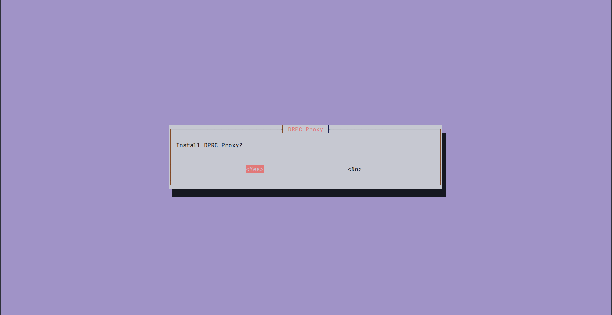
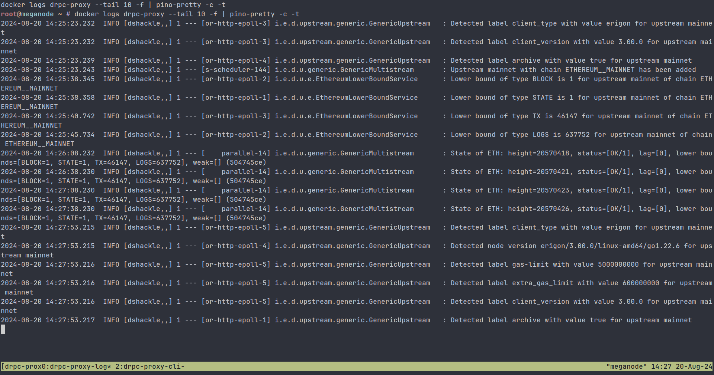

# Graph Setup
Repository containing the setup for a DRPC proxy (https://drpc.org/docs/providers/setup).
<p align="center">
  
  
</p> 

## Preliminaries
This particular setup uses an NGINX base reverse proxy. You can find it [here](https://github.com/DifferentialGraph/reverse-proxy).

## Installation
In order to setup the DRPC proxy first create a copy of the `.env` file named `.env.user`. Fill it with the options that suits your framework. Before proceeding with the installation you have to create the `config.yaml` under the folder `config`. You can start from the template `config-template.yaml` you find under the same folder.

From within the drpc-proxy folder run:
```sh
./install
```
to install the DRPC proxy. An interactive prompt will guide you through the various steps.

## Monitor & Manage
In order to monitor the DRPC proxy type
```sh
drpc-monitor
```
This will create a tmux session with the following windows:
- **drpc-proxy-log**: log of the drpc-proxy container. Shows all the operation performed by it.
- **drpc-proxy-cli**: in this window you can operate from within the drpc-proxy container.

In order to start, stop and restart the DRPC proxy use `drpc-start`, `drpc-stop` and `drpc-restart`.

## Options
- `PROVIDER_NAME`: the name of your company.
- `PROVIDER_HOST`: domain linked to your provider.
- `PROVIDER_CHAINS`: blockchains supported by your provider.